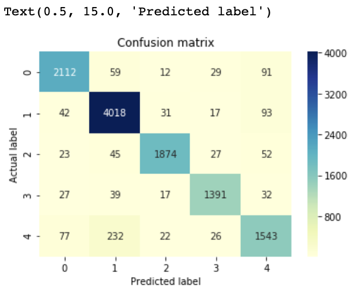

# User messages classification using Python + Flask and Machine Learning

## Setting app the application
To run the application on your computer you need to have some packages installed.
```bash
pip install flask
```
Also, you need to install some NLP packages as NLTK and download stopwords extension:
```bash
import nltk
nltk.download()
```

## Data
The dataset contains 4 columns. Text is column with user messages and category is corrensponding class of the message.

## Data overview and preprocessing
### I made some EDA on the data:
1. Deleted missing values
2. Deleted some values from category column that doesn't make any sense.
3. Made some visualizations.
4. Checked the values distribution of category column.

### Also, I preprocessed the text for training:
1. Removed stopwords
2. Lowercased all words
3. Changed data type to string

## Model training
I tried 3 approaches to this problem
1. Naive Bayes Classifier for Multinomial Models
Since all columns are linearly independent we are able to use Naive Bayes classifier here. Multinomial Naive Bayes classifier is a specific instance of a Naive Bayes classifier which uses a multinomial distribution for each of the features. 
#### 90% accuracy
2. Linear Support Vector Machine
Linear Support Vector Machine is widely regarded as one of the best text classification algorithms.
#### 86% accuracy
3. Logistic Regression
Logistic regression is a simple and easy to understand classification algorithm, and Logistic regression can be easily generalized to multiple classes.
#### 91% accuracy

So, I selected LG model.
### Results representation with confusion matrix


## App using
To test the app to need to run the app and go to the classify-text route and submit your message. The you will see a json file with {text: usertex: , category: classified category}.
